# **Implicit 3D Object Representations with Neural Networks (PyTorch)**

## **Project Summary**
This project revolves around overfiting the implict reprenstation of a 3D object through a neural network model, that can be later utilized to retrieve 3D mesh from a given set of occupancy field samples. The core components of the model include a 3D feature grid and a multilayer perceptron (MLP). Through training, the MLP learns to minimize the loss between the predicted and ground truth occupancy fields.

| Input                 | Training                | Output                |
|-------------------------|-------------------------|-------------------------|
| 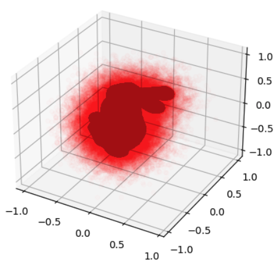 | 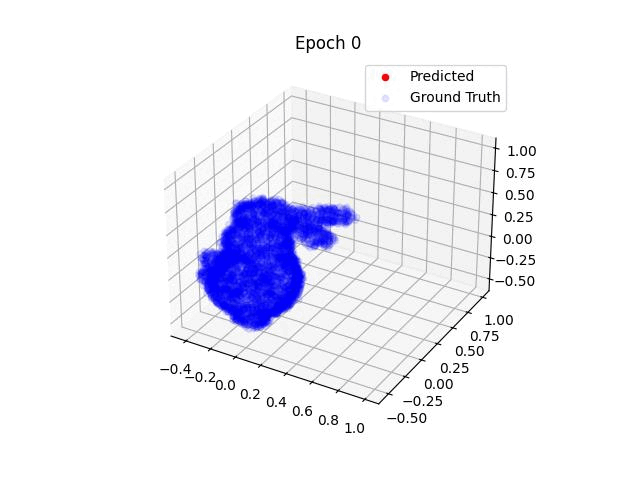 | 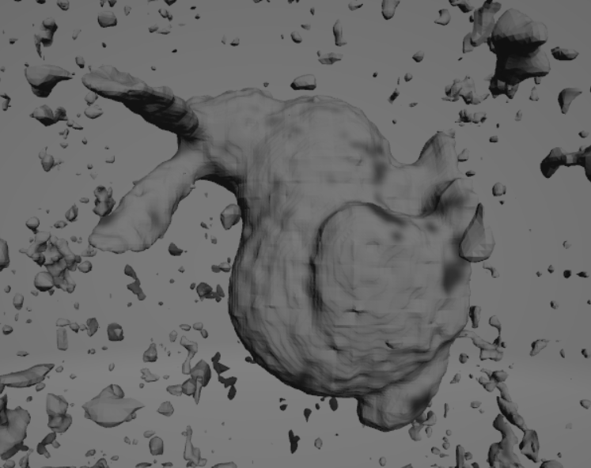 |


# **Running the Reconstruction Script with Command-Line Flags**
Step1: Clone the repo 

Step2: run the generate_points.py to genereate sythatic sample points
```
python3 generate_points.py 
```
Step 1: This script will download the dataset and store it in **data** folder .Then it will generate sample points for training the model, which will be stored in **processed** folder

Step3: adjust the grid parameters  in sdf/config.py (see optimal parameters below)

```
dense_param = {
"base_lod":  4,
"num_lod":  5,
"grid_dim" :3,
"interpolation_type":"closest",
}

hash_param = { "min_grid_res":6, 
              "max_grid_res":64, 
              "grid_dim" :10, 
              "num_LOD" :10, 
              "band_width":10, }

```

Step4: run the reconstruction script , which will generate the reconstructed meshes in **reconstructions** folder
```
python3 reconstruction.py [--model_type = {"hash" or "dense"} ] [--res]
```

### **Examples**:

**To overfit the model using a hash grid and reconsturct using gird res of 256**
```
python3 reconstruction.py --model_type hash --res 256
```

**To overfit the model using a dense grid and reconsturct using gird res of 256**
```
python3 reconstruction.py --model_type dense --res 256
```

## **Introduction** 


There are two primary methods for representing 3D objects: explicit and implicit representations. Explicit representation typically involves triangular meshes or point clouds generated by technologies like LIDAR sensors or active stereo imaging. Implicit representation, on the other hand, describes the object's topology using a mathematical function. This function, defined for every point in space, determines whether the point lies on the surface or outside. An example of such a function is the Signed Distance Function. It's worth noting that implicit functions are guaranteed to represent manifolds.

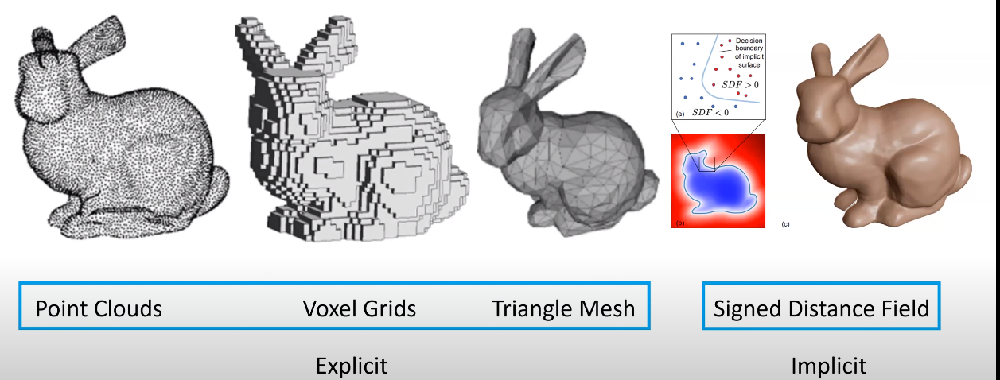

image source :“Reconstructing environments using SLAM,” www.youtube.com. https://www.youtube.com/watch?v=oWWzCacRmYI (accessed Apr. 26, 2024).
‌


## **Motivation**:
Nuerual networks are perfect approximaters of complex functions , such as SDF , Radiance , and images.However that comes with a high compute cost for training mlps to overfit compelex high frequency functions. This project utilizes hyprid represnetation , which provide a lower compute by adding more waight the memory using discrete grids

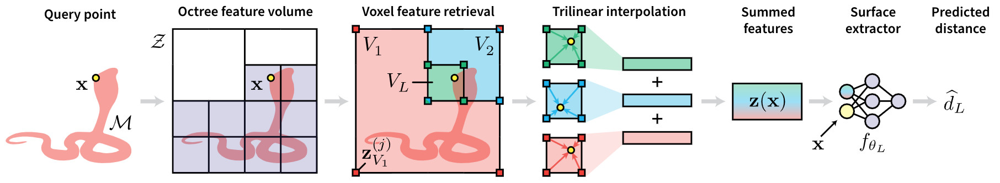

## **Methods:**
### 1- Deep MLPs with positional encoding:
Basically overfitting the data through a deep Fully connected layer. How the spectral bias theorem proves that there are limitations on the MLP's abiltiy toe capture high frequency details. Thus Poistional encodings are introudeced to boost the networks performance. However that approach is not practical for the given task. Why ? due to the long traning and inference time. However MLPs model are compact and easy to store in memroy. Unlike Discrte grids which grow O(N^d) in space complexity , but take less time to train and evaluate.

Lab7 -No positional encoding


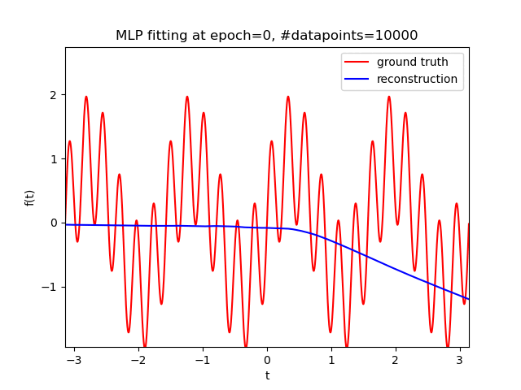


Lab7 -positional encoding


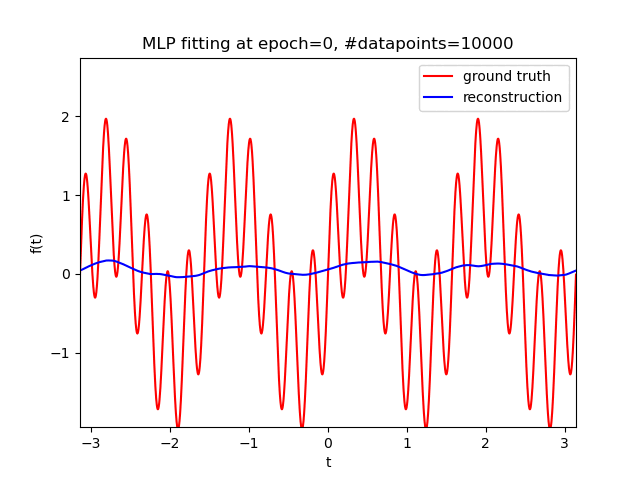

### 2- Hyprid Representaion - Dense Grid:

At every level of detail, feature points are located at the corners of each voxel node. The dimension of each feature point can vary depending on the task. For this particular project, the feature dimension is set to 1, as the output domain ranges from -1 to 1. Consequently, the code book for each level of detail is sized (res^grid_dim, feature_dim). The feature points within the grid are trainable parameters and are updated during backpropagation. When processing each input point, x, the occupancy value is obtained from the grid through interpolation, and then fed through small MLPs for optimization.


#### **Single LOD**:

| Data Set Name | Loss  | Model Size (KB) | LODs | Chamfer Distance | Hausdorff Distance |
|---------------|-------|------------------|-------|------------------|---------------------|
| bunny.obj    | 0.04765 | 65573.1455      | [256]    |  0.0522             |  0.6208       |
| column.obj    | 0.16340 | 65573.1455      |[256]    |0.0645             | 0.5620               |
| dragon_original.obj    | 0.06460 | 65573.1455      | [256]   | 0.0540             | 0.6045                |
| serapis.obj   |  0.04609 | 65573.1455            | [256]     | 0.0539           | 0.6045               |
| utah_teapot.obj    |0.07708 | 65573.1455           | [256]  | 0.0559          | 0.7078      |
| bunny.obj    | 0.04765 | 1061.1455      | [64]    |  0.1743            | 0.6561       |
| column.obj    | 0.52848 | 1061.1455      |[64]    |0.2208            | 0.7724               |
| dragon_original.obj    | 0.45242 | 1061.1455     | [64]   | 0.1929            | 0.6667                |
| serapis.obj   |  0.52916 | 1061.1455           | [64]     |  0.1468           |  0.7924              |
| utah_teapot.obj    |0.38634 | 1061.1455          | [64]  | 0.2055          | 0.7523      |


#### **Multiple LODs**:

| Data Set Name | Loss  | Model Size (KB) | LODs | Chamfer Distance | Hausdorff Distance |
|---------------|-------|------------------|-------|------------------|---------------------|
| bunny.obj    |  0.03538 | 74933.9961      | [16, 32, 64, 128, 256]    | 0.0282            |  0.8449       |
| column.obj    | 0.09187 | 74933.9961      |[16, 32, 64, 128, 256]    | 0.1997             | 1.1479              |
| dragon_original.obj    | 0.06062 |  74933.9961      | [16, 32, 64, 128, 256]   | 0.0206            | 0.0604                |
| serapis.obj   | 0.05035 | 74933.9961           | [16, 32, 64, 128, 256]     | 0.0274           | 0.1222              |
| utah_teapot.obj    |0.04787 | 74933.9961          | [16, 32, 64, 128, 256]  | 0.0201        | 0.1881    |

| Single LOD 1                 | Single LOD 2                 | Multiple LODs               |
|-------------------------|-------------------------|-------------------------|
| 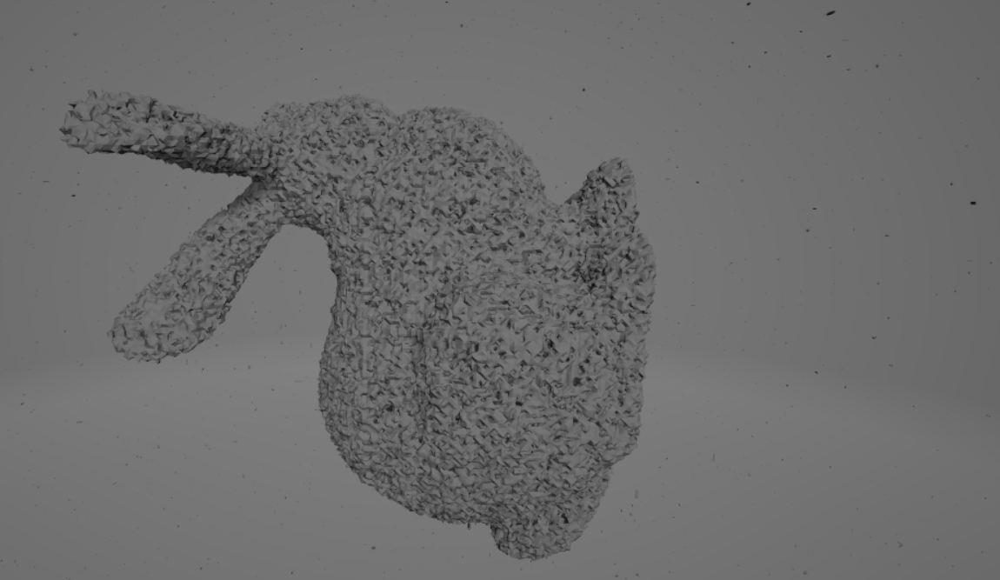 | 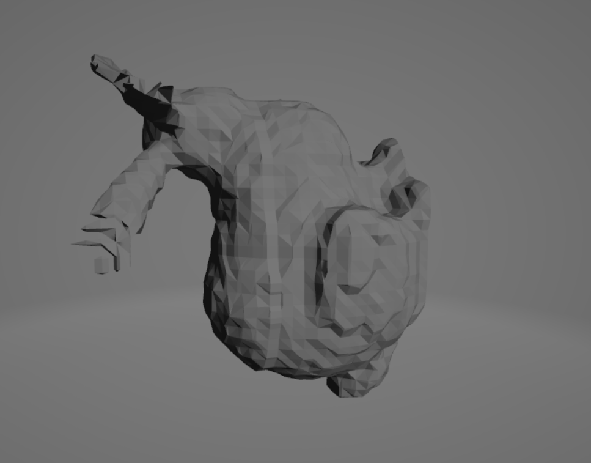 | 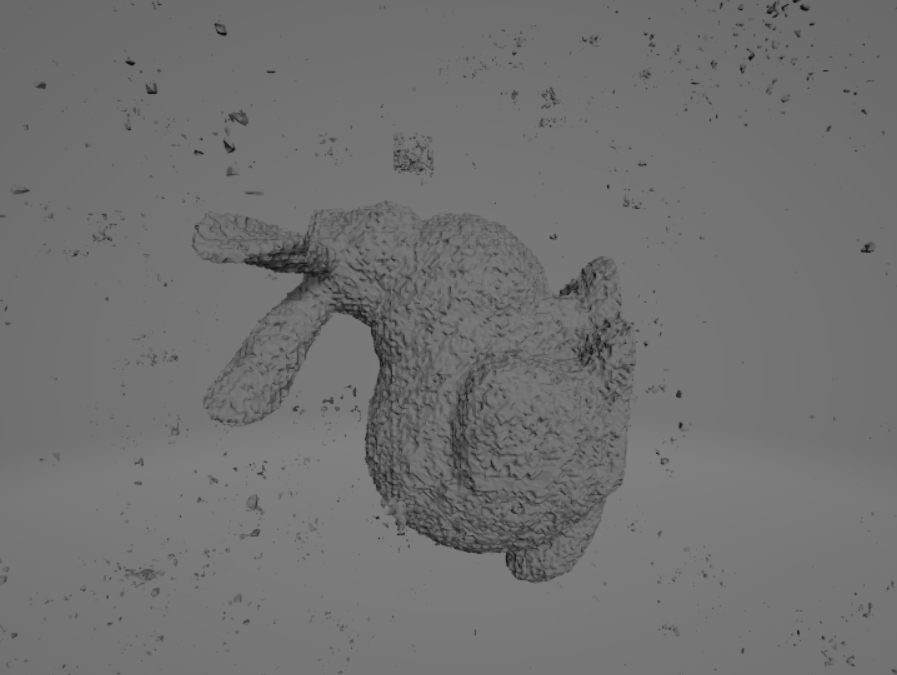 |
| LODS:[256] res = 256           | LODS:[64] res = 64           | LODS :[16, 32, 64, 128, 256] , res= 256         |


the results of the desne grid archticutre show that the higher the level of detail , the better approximaiation of the model has. which is equivlent to positional encodings in the models abitlity to capture higher frequency data. However, this enhancement comes at the expense of requiring more storage space for the model.
**


### 2- Hyprid Representaion - Hash Grid:
Hash grids provide a solution to the massive codebook size probelm, by using a hash table instead of a sparse grid. the values of the feature points are stored in a hash table and accssed via hashing fuction.Collision handling is done through back probagation. Too small bandwidth lead to a smaller codebook, casuing more collisions and subsequently higher noise in the rconsturcted mesh 


**bandwidth** = 2^10
| Data Set Name | Loss  | Model Size (KB) | LODs | Chamfer Distance | Hausdorff Distance |
|---------------|-------|------------------|-------|------------------|---------------------|
| bunny.obj    |  0.38123 | 57.9961     | [16, 32, 64, 128, 256]    |0.2629            |  1.2797       |
| column.obj    | 0.38123 | 57.9961      |[16, 32, 64, 128, 256]    | 0.1621             | 1.0145              |
| dragon_original.obj    | 57.9961 |  74933.9961      | [16, 32, 64, 128, 256]   | 0.2087            |1.3499                |
| serapis.obj   | 0.38123 | 57.9961           | [16, 32, 64, 128, 256]     | 0.2926           | 1.2285              |
| utah_teapot.obj    |0.38123 | 57.9961          | [16, 32, 64, 128, 256]  | 0.2974        | 1.2345    |


 | Multiple LODs               
|-------------------------|
| 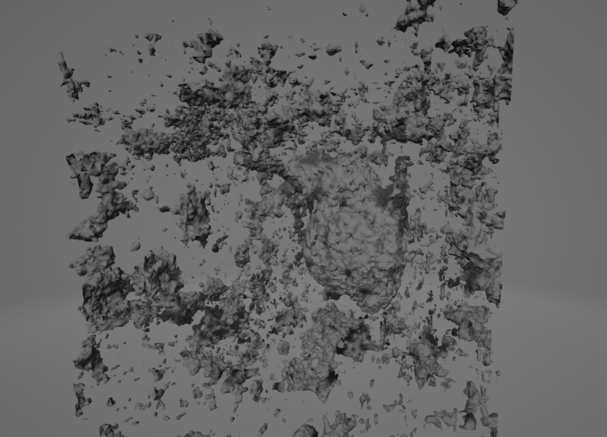 |
| LODS :[16, 32, 64, 128, 256] , res= 256    

 For the same Lods, we are getting smaller model size . However the construction error is higher. Suspect ? Collisions 
  try to increase the bandwidth ? 
  increasing the bandwidth takes takes the loss down up to an extent. too much bandwidth is essetnially dense grid and one time the model size was even larger !!! 

## Optimal results: 
  my optimal construction was obrained using a the hash grid throught the following parameters: 
   | Multiple LODs               
|-------------------------|
|  |
| LODS :[7, 8, 11, 14, 18, 23, 30, 38, 50, 64] , res= 256    
 
**  hash_param = {
"min_grid_res":6,
"max_grid_res":64,
"grid_dim" :10,
"num_LOD" :10,
"band_width":10,
}
**

regular grid resoluiton = 256
  

## Areas to improve : 
  
  
## Papers
1. [ReLU Fields: Continuous 3D Convolutional Neural Fields for Shape Reconstruction](https://arxiv.org/abs/2205.10824)

Take a look at:
   * Section 3: Method
   * Section 4.2: Occupancy Fields

2. [Instant Neural Graphics Primitives with a Multiresolution Hash Encoding](https://nvlabs.github.io/instant-ngp) 

Take a look at:
   * Section 3: Multiresolution Hash Encoding
   * Figure 3 - the way the HashGrid works
3. [NGLOD: Real-time Rendering with Implicit 3D Shapes](https://nv-tlabs.github.io/nglod/)

Take a look at:
   * Figure 3 - the way features of grid nodes at different LODs are used to predict occupancy/sdf value
